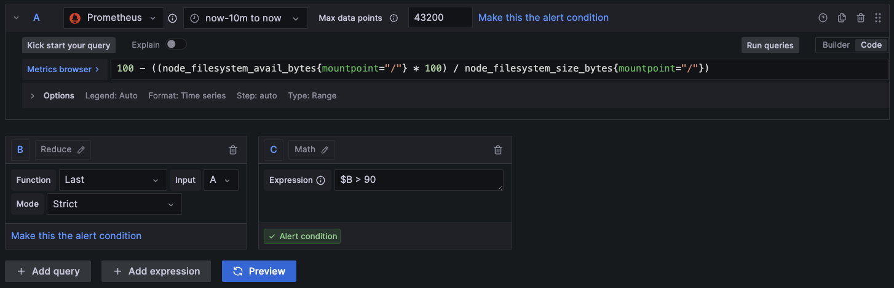

To follow this lab watch video: https://www.youtube.com/watch?v=Xmg8APTINOk

## Introduction

Prometheus® is an open source monitoring system developed by engineers at SoundCloud in 2012. Prometheus was the second project accepted into the Cloud Native Computing Foundation after Kubernetes, and also the second to graduate.

The Prometheus monitoring system includes a rich, multidimensional data model, a concise and powerful query language called PromQL, an efficient embedded time series database, and over 150 integrations with third-party systems.

Grafana Labs is proud to support the development of the Prometheus project by employing Prometheus maintainers, building first-class integration with Prometheus into Grafana, and ensuring Grafana customers receive Prometheus features they need.

Grafana renders metrics into powerful, flexible visualizations. It allows users to import Prometheus performance metrics as a data source and visualize the metrics as graphs and dashboards.

[Source](https://grafana.com/oss/prometheus/)

Learning objectives: 

* Prometheus: install and configure;
* Grafana: install and configure;
* Expose metrics of Mac / Linux using [Node Exporter](https://github.com/prometheus/node_exporter);
* Create and/or import dashboards in Grafana;
* Configure alert rules;

## Install Prometheus

[Installation process](https://prometheus.io/docs/prometheus/latest/installation/)

Install Prometheus using docker. 

Before doing so, adding `prometheus.yml` to configure Prometheus (so we can pass it over to container):

```yaml
global:
  scrape_interval: 15s

rule_files:
  # - "first.rules"
  # - "second.rules"

scrape_configs:

- job_name: prometheus
  static_configs:
    - targets: ['localhost:9090']

- job_name: mac
  static_configs:
    - targets: ['host.docker.internal:9100']

- job_name: rocky
  static_configs:
    - targets: ['rocky:9100']
```

Run Prometheus: 

```bash

docker run \
  -d --name prometheus \
  -p 9090:9090 \
  -v ./prometheus:/etc/prometheus/ \
  prom/prometheus

```

1. Job *prometheus* is for scrapping Prometheus itself
2. Job *mac* is for scrapping node exporter's metrics (and since Prometheus from docker container should access host's IP `host.docker.internal` is used, [more info](https://docs.docker.com/desktop/networking/#i-want-to-connect-from-a-container-to-a-service-on-the-host))
3. Job *rocky* is for scrapping node exporter's metrics from Rocky Linux

## Running Node Exporter

[Prometheus exporter](https://github.com/prometheus/node_exporter) for hardware and OS metrics exposed by *NIX kernels, written in Go with metric collectors.

How to: skipping this, as it's explained [here](https://prometheus.io/docs/guides/node-exporter/#installing-and-running-the-node-exporter).

To check exposed metrics visit `http://localhost:9100/metrics`.

## Install Grafana

Initial setup of Grafana is [explained here](https://grafana.com/docs/grafana/latest/setup-grafana/installation/docker/): 

```bash

docker run \
  -d --name grafana \
  -p 3000:3000 \
  -v "$PWD/grafana_data:/var/lib/grafana" \
  -e "GF_SMTP_ENABLED=true" \
  -e "GF_SMTP_HOST=host.docker.internal:1025" \
  -e "GF_SMTP_USER=" \
  -e "GF_SMTP_PASSWORD=" \
  grafana/grafana-oss

```

## Working with dashboards

1. Uptime: `node_time_seconds{job="rocky"} - node_boot_time_seconds{job="rocky"}`
2. Storage: `100 - ((node_filesystem_avail_bytes * 100) / node_filesystem_size_bytes)`
3. CPU: `(1 - avg(rate(node_cpu_seconds_total[5m])))*100`
4. Memory: `100 * (1 - ((avg_over_time(node_memory_MemFree_bytes[10m]) + avg_over_time(node_memory_Cached_bytes[10m]) + avg_over_time(node_memory_Buffers_bytes[10m])) / avg_over_time(node_memory_MemTotal_bytes[10m])))`

* [Node Exporter](https://grafana.com/grafana/dashboards/1860-node-exporter-full/)

## Alert rules

Using [maildev](https://github.com/maildev/maildev) for testing contact point:

```bash

docker run \
  -d --name maildev \
  -p 1080:1080 \
  -p 1025:1025 \
  maildev/maildev

```

Configure alert rule for monitoring disk space availability (i.e. >90 => fire alert):



[Templating Alerts](https://grafana.com/blog/2023/04/05/grafana-alerting-a-beginners-guide-to-templating-alert-notifications/)