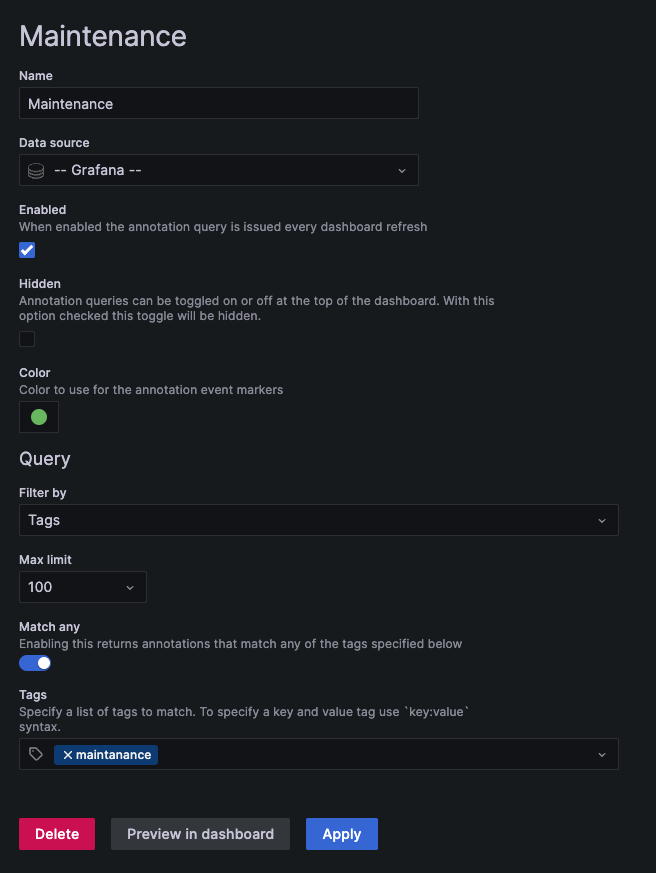
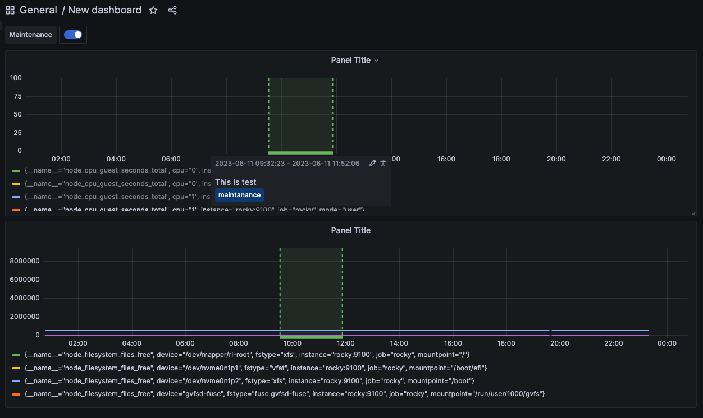

## Introduction

In previous versions of Grafana, you could only use the API for provisioning data sources and dashboards. But that required the service to be running before you started creating dashboards and you also needed to set up credentials for the HTTP API. In v5.0 we decided to improve this experience by adding a new active provisioning system that uses config files. This will make GitOps more natural as data sources and dashboards can be defined via files that can be version controlled. We hope to extend this system to later add support for users, orgs and alerts as well.

Learning objectives: 

* Grafana, provision via config files (passing https://docs.docker.com/engine/reference/commandline/run/)
* Add annotations

## Launch Grafana

TODO: docker compose

```bash

docker run \
  -d --name grafana \
  -p 3000:3000 \
  -v "./grafana_data:/var/lib/grafana" \
  -v  "./grafana/provisioning/:/etc/grafana/provisioning/" \
  --env-file config.monitoring \
  grafana/grafana-oss

```

Provision folder structure: 

```bash

grafana
└── provisioning
    ├── alerting
    │   └── email.yml
    ├── dashboards
    │   ├── dashboards.yml
    │   └── templates
    │       └── node_exporter.json
    └── datasources
        └── datasource.yml

```

## Annotations

Annotations can be added throughout entire dashboard (i.e. multiple panels at a time). For that we need to define tag like this: 


