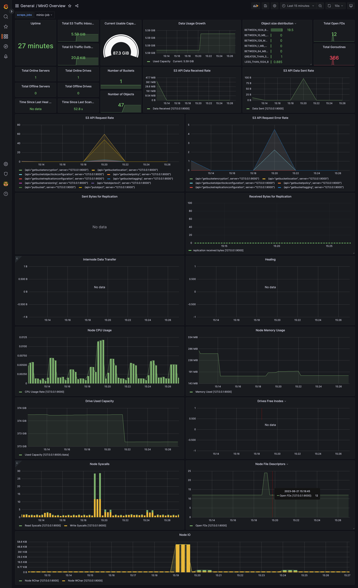

## Introduction

Prometheus's exporters and integrations exploring further with some familiar tools.

Learning objectives: 

* Explore further Prometheus's [exporters and integrations](https://prometheus.io/docs/instrumenting/exporters/)
* Practise with Grafana, especially with building dashboards

## Monitoring MinIO

First, let's get Minio started in docker, using [this approach](https://min.io/docs/minio/container/index.html).

```bash

docker run \
   -p 9000:9000 \
   -p 9090:9090 \
   --name minio \
   -v ./minio/data:/data \
   -e "MINIO_ROOT_USER=" \
   -e "MINIO_ROOT_PASSWORD=" \
   quay.io/minio/minio server /data --console-address ":9090"

   ```

Let's get some files added via UI: http://localhost:9090/browser/

Also I'd need MinIO cli installed, check how to [do it](https://min.io/docs/minio/linux/reference/minio-mc.html#mc-install), as it's simple to use for generate scrape block. And [MinIO dashboard](https://grafana.com/grafana/dashboards/15305-minio-overview/).

And Voilà!



## Monitoring GitHub

There is [GitHub Exporter](https://github.com/githubexporter/github-exporter) to monitor repositories. Let's expore metrics and build Grafana dashboard to get some insights from the user (or org) and it's repos. Initially inspired by [this post](https://grafana.com/blog/2019/12/04/how-to-explore-prometheus-with-easy-hello-world-projects/).

Let's get it started (pure docker):

```bash

docker run \
    -d --restart=always --name=github-exporter \
    -p 9171:9171 --env-file .env githubexporter/github-exporter

```

`.env` should have two lines: 

```
USERS=
GITHUB_TOKEN=

```

Alternatively could also pass repos, orgs (check [here](https://github.com/githubexporter/github-exporter)).

Token is needed since rate limit (i.e. 60 scrapes per hour for anonymous users). Check:

```bash

curl -I https://api.github.com/users/erudinsky

.... 

x-ratelimit-limit: 60
x-ratelimit-remaining: 51
x-ratelimit-reset: 1687356172
x-ratelimit-resource: core
x-ratelimit-used: 9

....

```

Search for `x-ratelimit-*` headers.

`http://localhost:9171/metrics` should return various metrics.

For Prometheus:

```yaml

- job_name: 'github_exporter'
  scrape_interval: 1h
  static_configs:
    - targets: ['host.docker.internal:9171']


```

[Dashboard for GitHub](github.json)