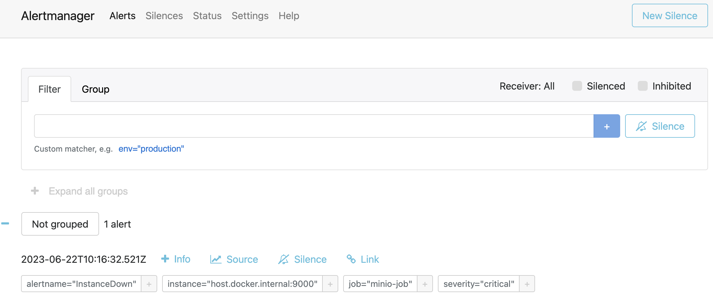
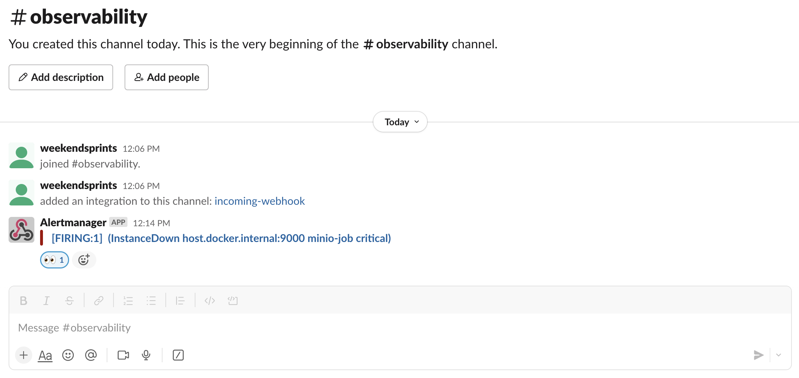

## Introduction

The Alertmanager handles alerts sent by client applications such as the Prometheus server. It takes care of deduplicating, grouping, and routing them to the correct receiver integrations such as email, PagerDuty, OpsGenie, or many other mechanisms thanks to the webhook receiver. It also takes care of silencing and inhibition of alerts.

## Install Alertmanager

```bash

docker run --name alertmanager \
    -d -p 127.0.0.1:9093:9093 \
    -v ./alertmanager:/etc/alertmanager/ \
    quay.io/prometheus/alertmanager

```

with `alertmanager.yml` 

```yml

global:
  resolve_timeout: 1m
  slack_api_url: <webhook>

route:
  receiver: 'slack-notifications'

receivers:
- name: 'slack-notifications'
  slack_configs:
  - channel: '#observability'
    send_resolved: true
    icon_url: https://avatars3.githubusercontent.com/u/3380462
    title: |-
     [{{ .Status | toUpper }}{{ if eq .Status "firing" }}:{{ .Alerts.Firing | len }}{{ end }}] {{ .CommonLabels.alertname }} for {{ .CommonLabels.job }}
     {{- if gt (len .CommonLabels) (len .GroupLabels) -}}
       {{" "}}(
       {{- with .CommonLabels.Remove .GroupLabels.Names }}
         {{- range $index, $label := .SortedPairs -}}
           {{ if $index }}, {{ end }}
           {{- $label.Name }}="{{ $label.Value -}}"
         {{- end }}
       {{- end -}}
       )
     {{- end }}
    text: >-
     {{ range .Alerts -}}
     *Alert:* {{ .Annotations.title }}{{ if .Labels.severity }} - `{{ .Labels.severity }}`{{ end }}

     *Description:* {{ .Annotations.description }}

     *Details:*
       {{ range .Labels.SortedPairs }} • *{{ .Name }}:* `{{ .Value }}`
       {{ end }}
     {{ end }}


```

An example of alert that I configured in Prometheus: 

```yml


groups:
- name: AllInstances
  rules:
  - alert: InstanceDown
    # Condition for alerting
    expr: up == 0
    for: 1m
    # Annotation - additional informational labels to store more information
    annotations:
      title: 'Instance {{ $labels.instance }} down'
      description: '{{ $labels.instance }} of job {{ $labels.job }} has been down for more than 1 minute.'
    # Labels - additional labels to be attached to the alert
    labels:
      severity: 'critical'


```

basically it gives critical severity in case of any of the targets down.

And in order to alert via alertmanager we have to set it in `prometheus.yml`

```yml


rule_files:
  - "rules.yml"

# Alerting specifies settings related to the Alertmanager
alerting:
  alertmanagers:
    - static_configs:
      - targets:
        # Alertmanager's default port is 9093
        - host.docker.internal:9093

```

A full guide on how to setup other channels for notifications can be found in [this article](https://grafana.com/blog/2020/02/25/step-by-step-guide-to-setting-up-prometheus-alertmanager-with-slack-pagerduty-and-gmail).



